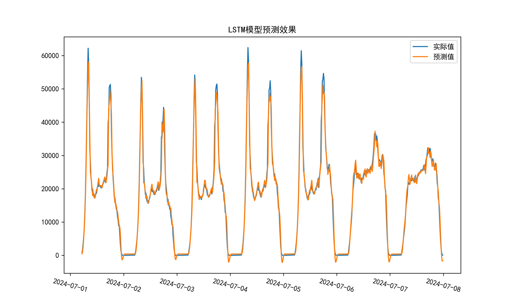

# 🚆 城轨线网客运量预测（LSTM模型）

本项目基于PyTorch实现了长短期记忆网络（LSTM），用于预测城轨线网15分钟粒度的客运量数据。

## 📂 项目结构

```
.
├── lstm.py              # 主程序，包含数据读取、模型训练与预测
├── lstm_model.pth       # 保存的模型参数文件
├── LSTM.png             # 模型预测结果可视化图
└── README.md            # 项目说明文档
```

## 🛠️ 环境配置

- Python 3.x
- PyTorch
- SQLAlchemy
- psycopg2
- pandas
- numpy
- matplotlib
- scikit-learn

## 🔧 使用方法

### 1. 配置数据库连接

修改`lstm.py`中的数据库配置（`db_config`），确保连接到你的本地PostgreSQL数据库。

### 2. 运行代码

```bash
python lstm.py
```

- 首次运行时，模型会训练并保存参数到`lstm_model.pth`。
- 再次运行时，会自动加载模型进行预测，无需重复训练。

## 📅 数据说明

- **训练数据**：2023-04-01 至 2024-07-01
- **测试数据**：2024-07-01 至 2024-07-08

## 📈 输出结果

- 预测结果图保存为：`LSTM.png`
- 模型评价指标（MSE、MAE、MAPE、R²）将在终端输出。


## 🚀 后续计划

- 优化模型超参数，提升预测性能
- 增加自动化数据更新及定时模型训练功能
